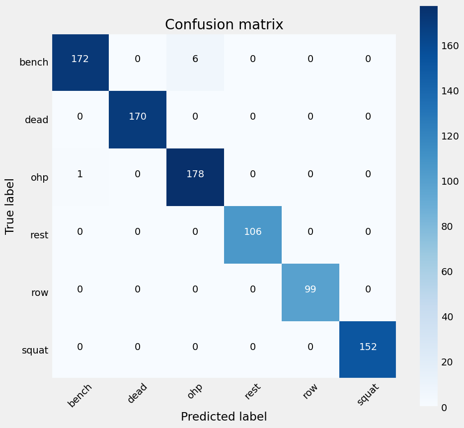

# BarbellReps-MLQS

This project provides a comprehensive framework for processing, visualizing, and modeling accelerometer and gyroscope data from fitness trackers. The goal is to create machine learning models that can classify barbell exercises and count repetitions.

## Table of Contents

1. [Introduction](#introduction)
2. [Data Conversion and Cleaning](#data-conversion-and-cleaning)
3. [Data Visualization](#data-visualization)
4. [Outlier Detection](#outlier-detection)
5. [Feature Engineering](#feature-engineering)
6. [Predictive Modeling](#predictive-modeling)
7. [Repetition Counting Algorithm](#repetition-counting-algorithm)
8. [Final Results](#final-results)
9. [Interesting Techniques Used](#interesting-techniques-used)
10. [Libraries and Technologies](#libraries-and-technologies)
11. [Project Structure](#project-structure)
12. [Key Directories](#key-directories)
13. [External Libraries](#external-libraries)

## Introduction

This project aims to analyze sensor data collected from a MetaMotion fitness tracker to classify different barbell exercises and accurately count repetitions. It falls under the realm of the quantified self, leveraging machine learning techniques to interpret wearable device data.

## Data Conversion and Cleaning

Raw data from the MetaMotion sensor is converted and read from CSV files. The data is split and cleaned to prepare it for analysis, ensuring that it is in a usable format for subsequent steps.

## Data Visualization

Time series data from the accelerometer and gyroscope are visualized to understand patterns and behaviors. Plotting this data helps in identifying trends and anomalies that may affect model performance.

## Outlier Detection

Outliers in the dataset are detected and handled using techniques like Chauvenet’s Criterion and the Local Outlier Factor. This step is crucial to improve the quality of the data and the reliability of the models.

- **Chauvenet’s Criterion**: A statistical method to identify and remove outliers from normally distributed data.
- **Local Outlier Factor**: An algorithm to find anomalies in data based on density deviations.

## Feature Engineering

Features are engineered from the raw data to enhance model performance. Techniques include:

- **Frequency Analysis**: Using Fast Fourier Transform (FFT) to move data to the frequency domain.
- **Low Pass Filter**: Applying filters to remove noise and smooth the data.
- **Principal Component Analysis (PCA)**: Reducing data dimensionality while retaining significant variance.
- **Clustering**: Grouping similar data points to identify patterns.

## Predictive Modeling

Multiple machine learning models are trained and evaluated:

- **Naive Bayes Classifier**: A probabilistic model based on Bayes' theorem with strong independence assumptions.
- **Support Vector Machines (SVMs)**: Models that find the optimal hyperplane for classification tasks.
- **Random Forest**: An ensemble learning method using multiple decision trees.
- **Neural Networks**: Models inspired by the human brain structure, capable of capturing complex patterns.
- **K-Nearest Neighbors (KNN)**: A non-parametric method used for classification based on feature similarity.
- **Decision Trees**: Models that make decisions based on feature values, forming a tree-like structure.

## Repetition Counting Algorithm

A custom algorithm is developed to accurately count exercise repetitions. This involves analyzing the processed sensor data to detect cycles corresponding to individual repetitions.

## Final Results

The final results of the classification models are presented using a **confusion matrix**, which visually represents the performance by showing the correctly and incorrectly classified instances for each exercise category. This allows for a comprehensive evaluation of the model's accuracy and the identification of any misclassifications.



## Interesting Techniques Used

- **Fast Fourier Transform (FFT)**: Utilized in the [`FrequencyAbstraction.py`](src/features/FrequencyAbstraction.py) module for frequency domain analysis. FFT helps identify dominant frequencies in sensor data.

- **Principal Component Analysis (PCA)**: Implemented in the [`DataTransformation.py`](src/features/DataTransformation.py) module for dimensionality reduction. PCA reduces data complexity while retaining significant features.

- **Rolling Window Calculations**: Used in the [`TemporalAbstraction.py`](src/features/TemporalAbstraction.py) module to compute statistical aggregations over time windows, capturing temporal patterns.

- **Forward Feature Selection**: Employed in the [`LearningAlgorithms.py`](src/models/LearningAlgorithms.py) module to iteratively select the most significant features for classification.

## Libraries and Technologies

- **NumPy**: For numerical computations and array operations.
- **Pandas**: For data manipulation and analysis.
- **scikit-learn**: Machine learning library providing algorithms like SVM, Decision Trees, and PCA.
- **Matplotlib**: Used for data visualization during exploratory analysis.
- **SciPy**: For scientific and technical computing tasks.

## Project Structure

```plaintext
├── README.md               # Project documentation
├── confusion_matrix.png    # Confusion matrix image
├── data
│   ├── external            # Data from third-party sources
│   ├── interim             # Intermediate transformed data
│   ├── processed           # Final datasets ready for modeling
│   └── raw                 # Original, unprocessed data
├── docs                    # Documentation for the project
├── models                  # Trained models and model outputs
├── notebooks               # Jupyter notebooks for experimentation
├── references              # Manuals and explanatory materials
├── reports
│   └── figures             # Generated graphics and figures
├── src                     # Source code for the project
│   ├── __init__.py         # Initializes the Python module
│   ├── data                # Scripts to download or generate data
│   ├── features            # Feature extraction scripts
│   │   ├── FrequencyAbstraction.py     # Frequency domain features
│   │   ├── DataTransformation.py       # Data normalization and PCA
│   │   ├── TemporalAbstraction.py      # Temporal feature abstraction
│   │   └── remove_outliers.py          # Outlier detection and removal
│   ├── models              # Machine learning models and algorithms
│   │   └── LearningAlgorithms.py       # Classification algorithms
│   └── visualization       # Data visualization scripts
├── LICENSE                 # License information
└── setup.py                # Setup script for package installation

```

## Key Directories

- **[`src/features`](src/features)**: Contains modules for feature extraction and data preprocessing, including frequency abstraction, PCA, temporal abstraction, and outlier removal.

- **[`src/models`](src/models)**: Includes machine learning algorithms for classification, implementing techniques like Support Vector Machines, Neural Networks, K-Nearest Neighbors, and Decision Trees.

- **[`notebooks`](notebooks)**: Jupyter notebooks for exploratory data analysis and experimentation.

## External Libraries

- **NumPy**: [https://numpy.org/](https://numpy.org/)
- **Pandas**: [https://pandas.pydata.org/](https://pandas.pydata.org/)
- **scikit-learn**: [https://scikit-learn.org/](https://scikit-learn.org/)
- **Matplotlib**: [https://matplotlib.org/](https://matplotlib.org/)
- **SciPy**: [https://www.scipy.org/](https://www.scipy.org/)
